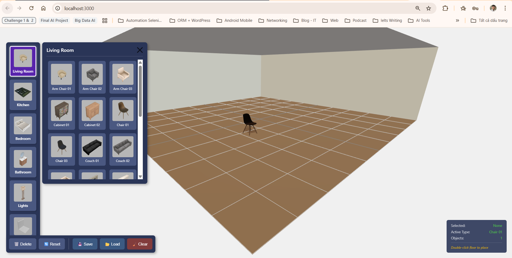
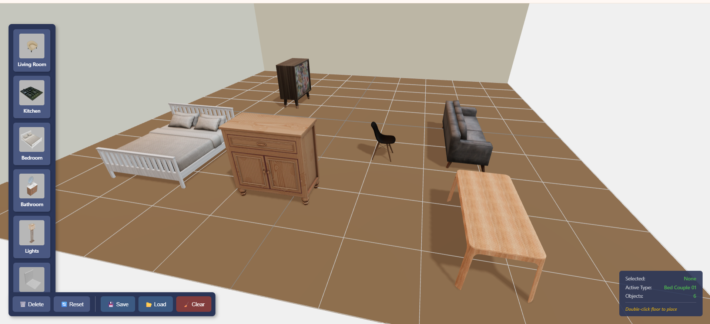
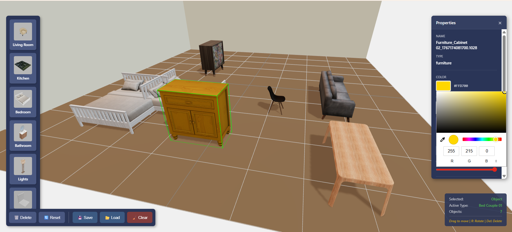
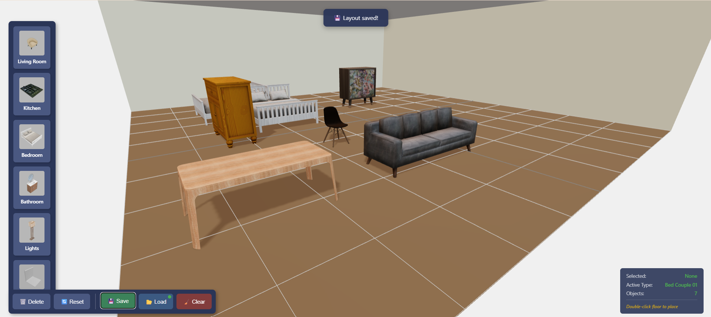

# 🏠 3D Home Design Application

[](https://threejs.org/)
[](https://vitejs.dev/)
[](https://developer.mozilla.org/en-US/docs/Web/JavaScript)
[](LICENSE)

A web-based **3D Home Design Application** built with **Three.js** that allows users to design and customize interior room layouts with interactive furniture placement.

---

## 👤 Author

| Field | Info |
|-------|------|
| **Name** | Le Tiep Tuyen |
| **Student ID** | 22020015 |
| **Course** | 3D Programming |
| **Date** | December 2025 |

---

## 🎬 Video Demo

📺 **Watch the demo video:** [Google Drive Link](https://drive.google.com/file/d/1bbB_XXbjymuFIBV3mxfU-kh80Q0XFrQK/view?usp=drive_link)


---

## 📸 Screenshots

### Main Interface


### Furniture Placement


### Selection & Highlight


### Color Customization


### Save & Load Layout



---

## ✨ Features

### 🏗️ Scene & Environment (R1)
- ✅ 3D room with floor, walls, and ceiling
- ✅ Realistic lighting with shadows
- ✅ HDRI environment for enhanced reflections
- ✅ OrbitControls (rotate, zoom, pan)
- ✅ Responsive canvas resize

### 🪑 Furniture System (R2)
- ✅ 40+ furniture models (GLB format)
- ✅ 6 categories: Living Room, Kitchen, Bedroom, Bathroom, Lights, Structure
- ✅ Double-click to place furniture
- ✅ Click to select with visual highlight
- ✅ Drag to move within room bounds
- ✅ Color/material customization

### 🎮 Application Controls (R3)
- ✅ Left vertical palette UI
- ✅ Delete selected furniture
- ✅ Reset entire layout
- ✅ Save layout to localStorage
- ✅ Load saved layout
- ✅ Clear saved storage
- ✅ Real-time status indicators

---

## 🚀 Quick Start

### Prerequisites
- Node.js 18+
- npm or yarn

### Installation

```bash
# Clone the repository
git clone https://github.com/LeTiepTuyen/3D-Home-Design-App.git

# Navigate to project folder
cd 3D-Home-Design-App

# Install dependencies
npm install

# Start development server
npm run dev
```

### Access
Open your browser at: `http://localhost:3000`

---

## 🎮 Controls

| Action | Control |
|--------|---------|
| **Rotate view** | Left mouse drag |
| **Zoom** | Mouse scroll |
| **Pan** | Right mouse drag |
| **Place furniture** | Double-click on floor |
| **Select furniture** | Single click on object |
| **Move furniture** | Drag selected object |
| **Change color** | Use color picker (when selected) |
| **Delete** | Click Delete button |
| **Reset** | Click Reset button |
| **Save** | Click Save button |
| **Load** | Click Load button |
| **Clear storage** | Click Clear button |

---

## 📁 Project Structure

```
3D-Home-Design-App/
├── public/
│   ├── assets/
│   │   ├── bg/          # HDRI environment
│   │   ├── images/      # Furniture thumbnails
│   │   ├── models/      # 3D furniture models (GLB)
│   │   └── ui/          # UI icons
│   └── data/
│       └── params.json  # Furniture catalog
├── src/
│   ├── core/            # Scene, Camera, Lighting, Controls
│   ├── loaders/         # GLTF model loader
│   ├── state/           # App state & Storage manager
│   ├── systems/         # Placement & Selection systems
│   ├── ui/              # UI components
│   ├── styles/          # CSS styles
│   └── main.js          # Entry point
├── demo/                # Screenshots for README
├── index.html
├── package.json
└── vite.config.js
```

---

## 🛠️ Tech Stack

- **Three.js** - 3D rendering engine
- **Vite** - Build tool & dev server
- **GLTFLoader** - 3D model loading
- **OrbitControls** - Camera navigation
- **localStorage** - State persistence

---

## 📋 Requirements Checklist

| Requirement | Status |
|-------------|--------|
| Scene renders room (floor + walls + ceiling) | ✅ |
| OrbitControls navigation (rotate/zoom/pan) | ✅ |
| At least 3 furniture types (sofa/table/chair) | ✅ (40+) |
| Add furniture via UI palette | ✅ |
| Select furniture via raycasting | ✅ |
| Selected object highlight | ✅ |
| Move furniture within bounds | ✅ |
| Change furniture color/material | ✅ |
| Remove furniture & reset layout | ✅ |
| UI indicates selected/active items | ✅ |
| Save/Load layout (localStorage) | ✅ |
| Professional README | ✅ |

---

## ⚠️ Known Limitations

- Some furniture models may require manual scale adjustment
- Touch/mobile interactions not fully optimized
- No undo/redo functionality

---

## 📄 License

This project is licensed under the MIT License - see the [LICENSE](LICENSE) file for details.

---

## 🙏 Acknowledgments

- Furniture models adapted from [OrangeAVA/Creative-Technology-with-Three.js](https://github.com/OrangeAVA/Creative-Technology-with-Three.js)
- HDRI environment from [Poly Haven](https://polyhaven.com/)

---

<p align="center">
  Made with ❤️ by <strong>Le Tiep Tuyen</strong> | 3D Programming Course 2025
</p>
